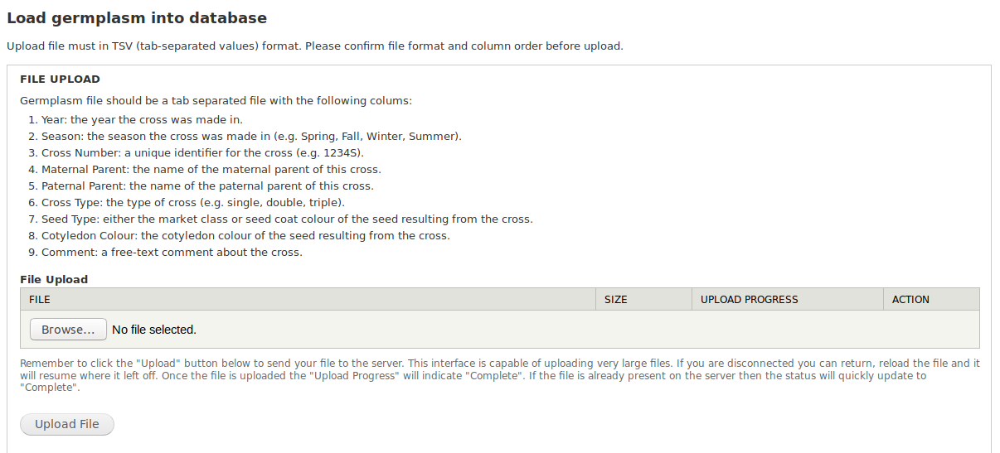

Features
========
Germplasm Cross Importer is developed following `Tripal Developer’s Guide » Creating Custom Data Loaders <https://tripal.readthedocs.io/en/latest/dev_guide/custom_data_loader.html>`_.

File Upload
-----------
Requirements for upload files can be found easily in the module.

Prefix and Organism
-------------------
Organism must be selected from dropdown menu before upload.
Prefix text box is optional to fill in and default the value is 'GERM'.
The uniquename for each germplam will be 'GERM' followed by it's `stock id <https://laceysanderson.github.io/chado-docs/stock/tables/stock.html>`_ but user can give a unique prefix to replace 'GERM'.

.. image:: features.2.prefix_organism.png

Bulk load germplasm crosses
---------------------------
As Chado is the data store for Tripal, germplasm data will be saved in five `chado tables <https://laceysanderson.github.io/chado-docs/index.html>`_: cv, cvterm, stock, stockprop, and stock_relationship in this module.

  - required control vocabularies (cv) and cvterms will be checked before data loading

  - germplasm crosses will be loaded into table stock

  - properties for each germplasm will be loaded into table stockprop

  - relationships with parents for each germplasm will be loaded into table stock_relationship

  .. note::

    CV and cvterm used in this module is customized for our database. Users can check their own database and modify the cv and cvterm accordingly.

PHP UnitTest
------------
PHP UnitTest is created to guarantee the integrity of data insertion.
