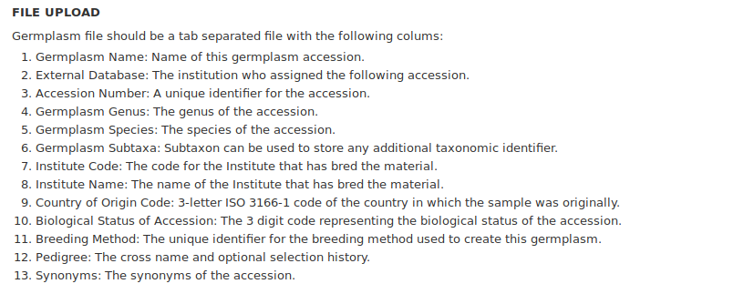
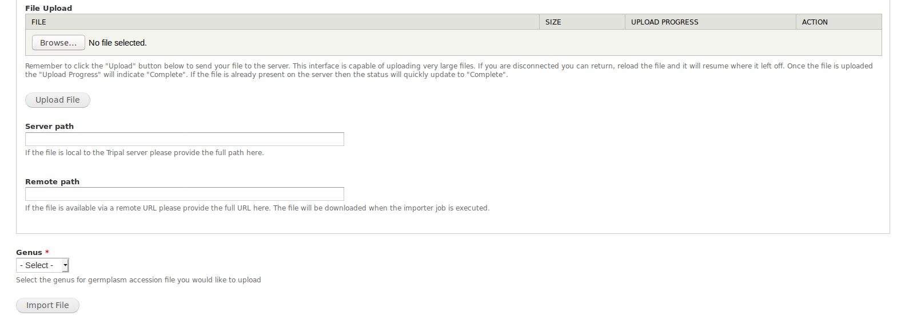
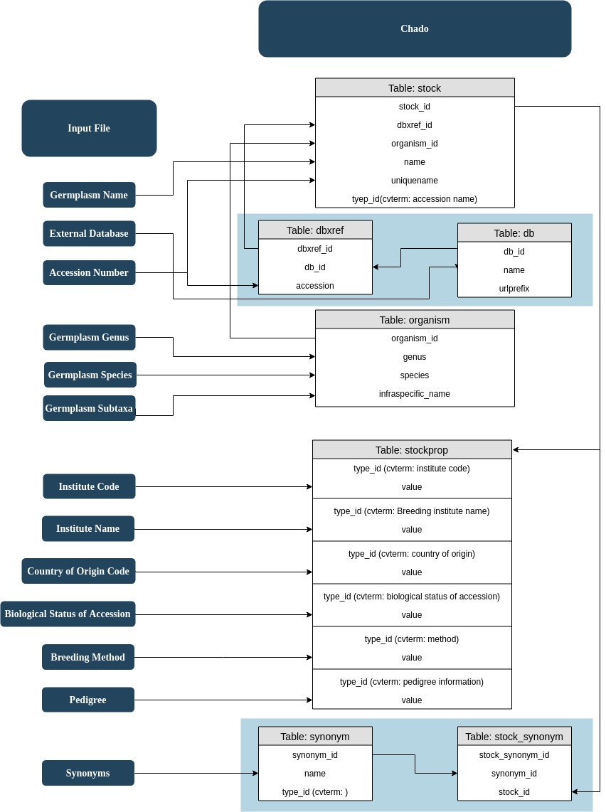

Germplasm Accession Importer
============================

File Upload
-----------
Format requirements for upload files can be found easily in UI while using this module.

.. note::

  For column 2 (External Database), the name in file must exist in your database in chado table:db already.

  For column 12 (Pedigree), pedigree information is recommended to save in format of ``maternal-parent-name/paternal-parent-name``.

  For column 13 (Synonyms), multiple synonyms are allowed but must be separated by semi-colons (e.g.  ``syn1;syn2;syn3``).

Select Genus
------------
Genus of the accessions in file must be selected from dropdown menu before upload. All accessions in one file must belong to same genus and match this selection.

Bulk load germplasm accessions
------------------------------
As Chado is the data store for Tripal, germplasm accessions will be saved in several `chado tables <https://laceysanderson.github.io/chado-docs/index.html>`_: cv, cvterm, stock, stockprop, db, dbxref, synonym and stock_synonym for this importer.

The general idea of how accession information will be saved in database:

- required control vocabularies (CVs) and CV terms will be checked before data loading

- organism of one accession is determined by germplasm genus, species and subtaxa(optional)

- germplasm accession will be loaded into table stock, dexref, and db

- properties will be loaded into table stockprop

- synonyms will be loaded into table synonym and stock_synonym

A diagram:

