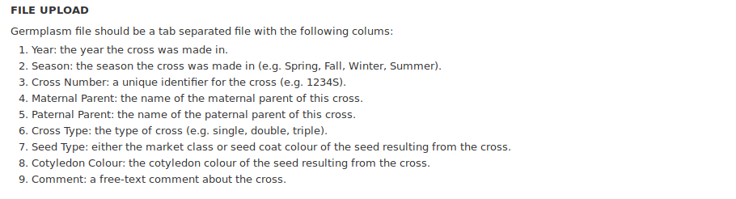

Germplasm Cross Importer
========================

File Upload
-----------
Format requirements for upload files can be found easily in UI while using this module.

Prefix and Organism
-------------------
Organism must be selected from dropdown menu before upload.
Prefix text box is optional to fill in and default the value is 'GERM'.
The uniquename for each germplasm will be 'GERM' followed by it's `stock id <https://laceysanderson.github.io/chado-docs/stock/tables/stock.html>`_ but user can give a unique prefix to replace 'GERM'.

.. image:: cross.2.prefix_organism.png

Bulk load germplasm crosses
---------------------------
As Chado is the data store for Tripal, germplasm corsses will be saved in five `chado tables <https://laceysanderson.github.io/chado-docs/index.html>`_: cv, cvterm, stock, stockprop, and stock_relationship in this module.

  - required control vocabularies (CVs) and CV terms will be checked before data loading

  - germplasm crosses will be loaded into table stock

  - properties for each germplasm will be loaded into table stockprop

  - relationships with parents for each germplasm will be loaded into table stock_relationship
