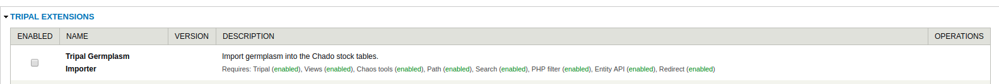
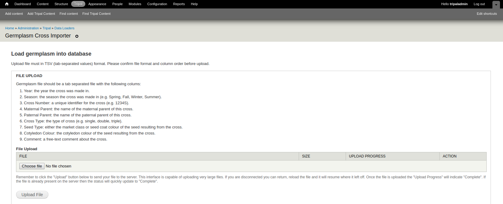

Installation
============

.. note::

  It is recommended to clear cashes regularly in this installation processes.

Download Module
---------------

The module is availabe as one repository for `Pulse Bioinformatics, University of Saskatchewan <https://github.com/UofS-Pulse-Binfo>`_ on GitHub. Recommended method of downloading and installation is using git:

.. code:: bash

  cd [your drupal root]/sites/all/modules

  git clone https://github.com/UofS-Pulse-Binfo/tripal_germplasm_importer.git

Germplasm Cross Importer should be installed by now and the status of our module can be checked in "Home » Administration » Tripal » Modules".

Enable Module
-------------

The module can be enabled in "Home » Administration » Tripal » Modules" by select the checkbox under "ENABLED" column (as shown in above image) and then click on "Save Configuration" button by the bottom of page.

Another method that can enable our module is using drush:

.. code:: bash

  drush pm-enable tripal_germplasm_importer

Use Module
----------
After Germplasm Cross Importer is installed and enabled, it should be ready to use in "Home » Administration » Tripal » Data Loader".

